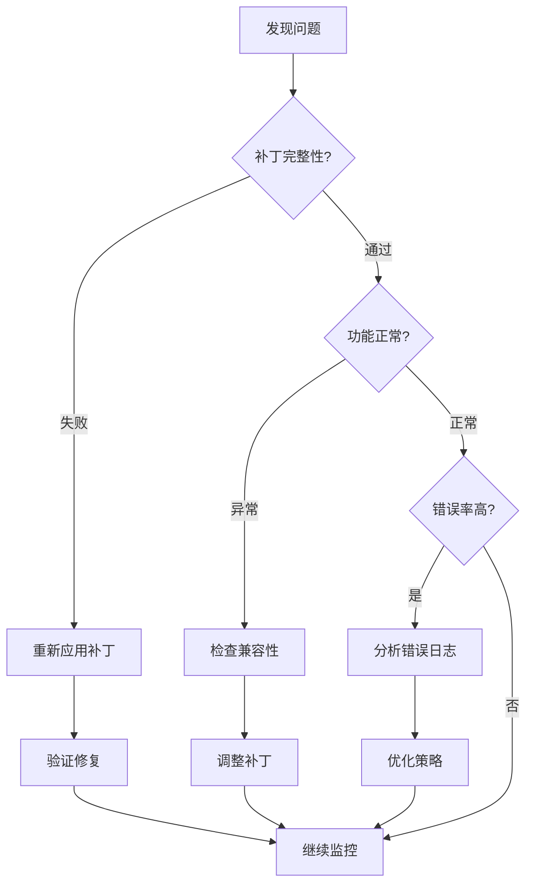

# 🔍 VSCode Augment 扩展隐私补丁监控指南

## 📋 监控概述

本指南帮助你监控基于证据的隐私补丁的运行状态，确保隐私保护持续有效且不影响扩展的正常功能。

## 🎯 监控目标

### 主要目标
- ✅ **补丁完整性** - 确保隐私保护代码未被破坏
- 🛡️ **隐私保护效果** - 验证遥测拦截是否正常工作
- 🔧 **功能完整性** - 确保扩展核心功能不受影响
- ⚠️ **问题早期发现** - 及时发现和解决潜在问题

### 关键指标
- 补丁签名完整性: 100%
- 功能保留率: ≥80%
- 错误率: ≤20%
- 拦截活动: 正常记录

## 🔍 监控方法

### 1. 自动化监控

#### 快速检查 (推荐每天1次)
```bash
python simple_patch_monitor.py
# 选择选项 1: 运行快速检查
```

**检查内容:**
- 补丁签名完整性
- 日志输出功能
- 核心功能保留
- 生成监控建议

#### 定时监控计划
```bash
# 创建监控计划
python simple_patch_monitor.py
# 选择选项 2: 创建监控计划

# 运行定时检查
monitor_schedule.bat
```

### 2. 手动监控

#### VSCode 开发者控制台监控
1. **打开控制台**: `Ctrl+Shift+I` (Windows) 或 `Cmd+Option+I` (Mac)
2. **切换到 Console 标签**
3. **查找关键日志**:
   - `[CRITICAL BLOCK]` - 严重威胁被拦截
   - `[HIGH BLOCK]` - 高威胁被拦截  
   - `[NETWORK MONITOR]` - 网络请求监控
   - `[ERROR MONITOR]` - 错误监控

#### 功能测试监控
定期测试扩展的核心功能:
- ✅ 代码补全和提示
- ✅ 文件操作和编辑
- ✅ 命令执行
- ✅ 语言服务功能

## 📊 监控仪表板

### 健康状态指标

| 指标 | 良好 | 警告 | 危险 |
|------|------|------|------|
| 补丁完整性 | 100% | 80-99% | <80% |
| 功能保留率 | ≥90% | 70-89% | <70% |
| 错误率 | ≤10% | 11-20% | >20% |
| 拦截活动 | 正常 | 偶尔 | 无活动 |

### 状态解读

#### 🟢 健康状态
- 所有检查通过
- 补丁正常工作
- 功能完全保留
- 继续正常使用

#### 🟡 警告状态  
- 部分检查失败
- 需要关注问题
- 建议进行调整
- 增加监控频率

#### 🔴 危险状态
- 多项检查失败
- 补丁可能失效
- 功能严重受影响
- 需要立即处理

## ⚠️ 警报和问题处理

### 常见警报类型

#### 1. 补丁完整性警报
**症状**: 补丁签名检查失败
**原因**: 
- 扩展文件被覆盖
- VSCode 自动更新
- 其他程序修改文件

**处理方法**:
```bash
# 重新应用补丁
python evidence_based_patch_generator.py
```

#### 2. 功能异常警报
**症状**: 扩展功能不正常
**原因**:
- 补丁过于激进
- 兼容性问题
- VSCode 版本冲突

**处理方法**:
```bash
# 恢复原始文件
copy extension_backup_*.js extension.js

# 或应用更保守的补丁
python monitor_only_patch.py
```

#### 3. 错误率过高警报
**症状**: 控制台大量错误
**原因**:
- 补丁代码冲突
- 网络请求被误拦截
- 函数调用异常

**处理方法**:
1. 检查错误详情
2. 调整补丁策略
3. 必要时恢复原文件

### 问题诊断流程



## 📋 监控清单

### 日常监控 (每天)
- [ ] 运行快速补丁检查
- [ ] 查看 VSCode 控制台日志
- [ ] 测试扩展基本功能
- [ ] 检查是否有错误提示

### 周度监控 (每周)
- [ ] 运行完整验证测试
- [ ] 检查补丁覆盖率
- [ ] 分析拦截活动统计
- [ ] 更新监控配置

### 月度监控 (每月)
- [ ] 全面功能测试
- [ ] 性能影响评估
- [ ] 补丁策略优化
- [ ] 备份和恢复测试

## 🔧 监控工具使用

### 工具清单
1. **simple_patch_monitor.py** - 快速监控检查
2. **evidence_patch_verifier.py** - 详细补丁验证
3. **runtime_monitoring_system.py** - 实时监控系统
4. **monitor_schedule.bat** - 定时监控脚本

### 使用场景

#### 日常检查
```bash
python simple_patch_monitor.py
```

#### 详细验证
```bash
python evidence_patch_verifier.py
```

#### 实时监控
```bash
python runtime_monitoring_system.py
```

## 📈 监控数据分析

### 关键指标趋势
- **拦截次数趋势** - 隐私保护活跃度
- **错误率变化** - 稳定性指标
- **功能完整性** - 用户体验指标
- **性能影响** - 系统资源使用

### 数据收集
监控数据自动保存在:
- `patch_monitoring_report_*.json` - 监控报告
- `smart_analysis_report.json` - 分析报告
- `privacy_audit_results.json` - 隐私审计结果

## 💡 最佳实践

### 监控频率建议
- **高频监控** (每小时): 新部署后48小时
- **日常监控** (每天): 正常运行期间
- **定期检查** (每周): 深度验证和优化

### 预防措施
1. **定期备份** 扩展文件和补丁
2. **版本控制** 跟踪补丁变更
3. **测试环境** 先在测试环境验证
4. **回滚计划** 准备快速恢复方案

### 性能优化
- 监控脚本轻量化运行
- 避免频繁的文件读写
- 合理设置检查间隔
- 及时清理历史日志

## 🆘 紧急处理

### 紧急情况识别
- 扩展完全无法使用
- 大量错误导致 VSCode 崩溃
- 隐私保护完全失效
- 数据泄露风险

### 紧急处理步骤
1. **立即停用扩展**
2. **恢复原始文件**
3. **分析问题原因**
4. **制定修复方案**
5. **测试验证修复**
6. **重新部署补丁**

### 紧急恢复命令
```bash
# 快速恢复原始文件
copy extension_backup_20250814_174511.js extension.js

# 重启 VSCode
# 验证扩展功能正常

# 重新分析和应用补丁
python smart_js_analyzer.py
python evidence_based_patch_generator.py
```

## 📞 支持和帮助

### 自助诊断
1. 查看监控报告中的建议
2. 运行完整的验证测试
3. 检查 VSCode 版本兼容性
4. 参考问题处理流程

### 问题报告
如果遇到无法解决的问题，请收集:
- 监控报告文件
- VSCode 错误日志
- 扩展版本信息
- 操作系统信息

---

**记住**: 监控是确保隐私保护持续有效的关键。定期检查，及时处理问题，保持补丁的健康状态！🛡️